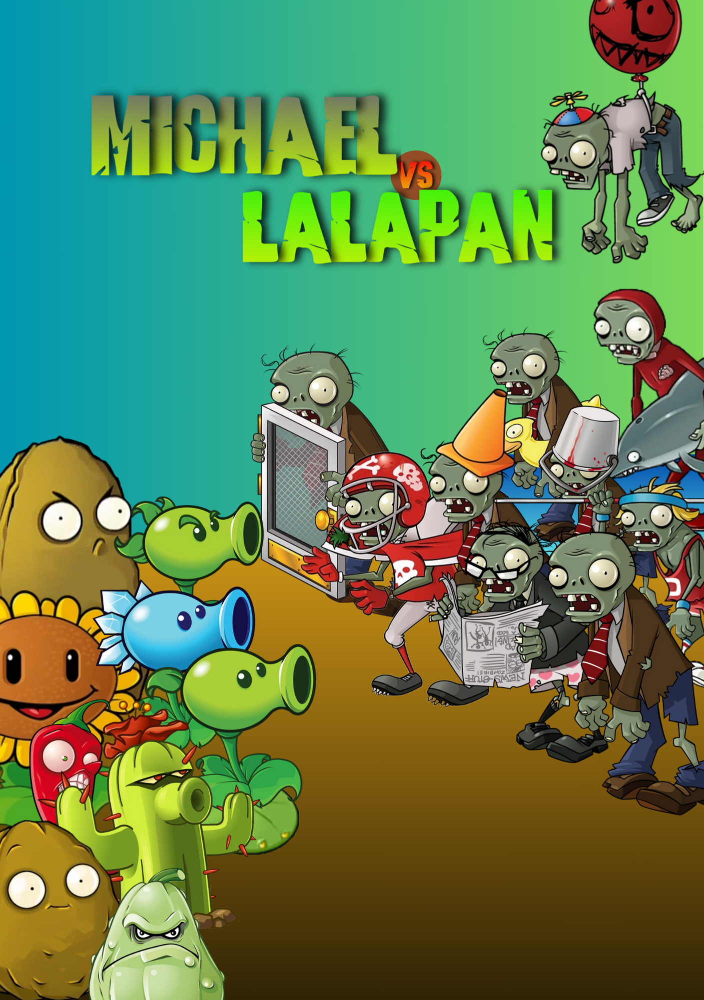

# 
 Michael Vs Lalapan

Tugas Besar IF2212 Pemrograman Berorientasi Objek STI 2024

## Deskripsi

Michael vs. Lalapan adalah versi yang lebih sederhana dari permainan terkenal Plant vs. Zombies. Tujuan permainan adalah melindungi rumah pemain dari serangan zombie dengan menanam tanaman secara strategis. Ada berbagai jenis tanaman yang dapat menyerang zombie, dan pemain harus menanamnya dengan bijaksana untuk menjaga keamanan rumah. Setiap tanaman dan zombie memiliki aksi unik tersendiri.

## Anggota
| No |      Nama      |   NIM    |
| -- | -------------- | -------- |
| 1. | Yasra Zhafirah | 18222002 |
| 2. |   Rashid May   | 18222014 |
| 3. |  Vini Putiasa  | 18222030 |
| 4. |  Ervina Limka  | 18222100 |

## Cara Menjalankan Program Michael vs. Lalapan
Program Michael vs. Lalapan dapat dijalankan dengan cara sebagai berikut.
1. Open file dari folder `Tubes-OOP-MichealVsLalapan` menggunakan **IntelliJ iDEA**.
2. Configure JDK yang sesuai (Apabila tidak bisa, harus terlebih dahulu men-_download_ **JDK Development Kit**) 
3. Setelah itu, klik `run` pada `main` file.

## Buklet Michael vs. Lalapan
Petunjuk permainan dan penjelasan lengkapnya dapat di akses pada link di bawah ini.

